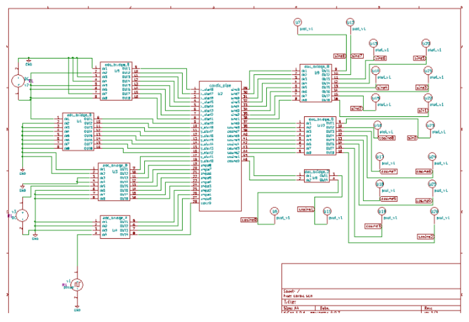
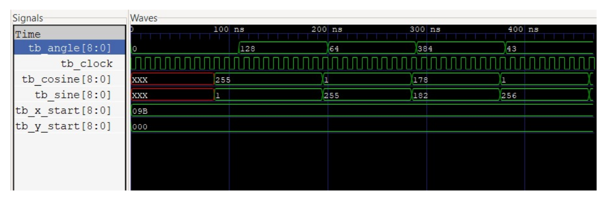
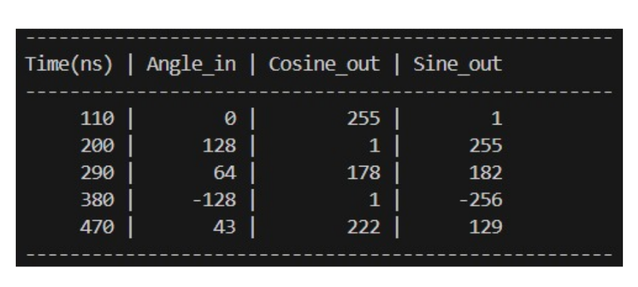
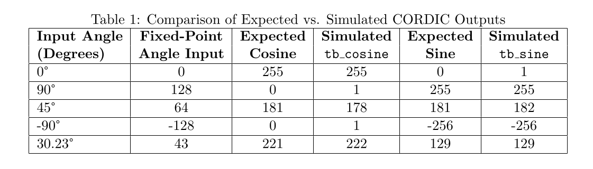

#  Pipelined CORDIC Processor

This repository contains the **design and verification files** for a **9-bit, 9-stage pipelined CORDIC (Coordinate Rotation Digital Computer) processor**. The project is developed using a suite of **open-source EDA tools** centered around **eSim**. eSim is a powerful platform that integrates essential tools like **KiCad** (for schematic capture), **Ngspice** (for circuit simulation), **Verilator**, **Iverilog**, and **GTKWave** (for waveform viewing), creating a seamless design and verification environment. The processor is optimized for **high-throughput and real-time applications**.

The project is developed using **open-source EDA tools** — **eSim**, **Iverilog**, and **GTKWave** — and is optimized for **high-throughput and real-time applications**.

The **CORDIC algorithm** is chosen for its **hardware efficiency**, as it computes trigonometric functions using only **shift** and **addition** operations.  
This 9-bit implementation serves as a verified foundation for a future, higher-precision **18-bit design**.

---

##  What is CORDIC?

The **CORDIC algorithm** (Coordinate Rotation Digital Computer) is an iterative, multiplier-less technique used to perform **vector rotations**.  
In **Rotation Mode**, it rotates a starting vector by a target angle through a series of smaller micro-rotations.

The angles of these micro-rotations are chosen such that their tangents are powers of two, allowing multiplications to be implemented as **simple bit-shifts**.

### Iterative Equations

$$
x_{i+1} = x_i - d_i \cdot y_i \cdot 2^{-i}
$$

$$
y_{i+1} = y_i + d_i \cdot x_i \cdot 2^{-i}
$$

$$
z_{i+1} = z_i - d_i \cdot \alpha_i
$$

where  

$$
\alpha_i = \arctan(2^{-i})
$$

To compute sine and cosine, the starting vector $(x_0, y_0)$ is initialized as:

$$
(x_0, y_0) = \left( \frac{1}{K}, 0 \right)
$$

where **K** is the inherent gain of the algorithm.

After **N iterations**, the final vector approximates:

$$
(x_N, y_N) = (\cos(\theta), \sin(\theta))
$$

---

## Fixed-Point Representation

**Fixed-point representation** is used to represent fractional numbers with a fixed number of bits for both integer and fractional parts.  
It is preferred in hardware for **speed** and **resource efficiency**, compared to floating-point arithmetic.

### Format Used in This Project

- **Bit Width:** 9-bit signed fixed-point numbers  
- **Angle:** Mapped from degrees `[-180°, +180°)` to integers `[-256, 255]`  
- **Sine/Cosine:** Mapped from `[-1.0, +1.0)` to integers `[-256, 255]`

**Examples:**
- `1.0 → 255`
- `1/K ≈ 0.60725 → 155`

---

##  Project Details

### Verilog Implementation
- The processor is implemented in **Verilog HDL**.
- It consists of a **9-stage pipeline**, where each stage performs one iteration of the CORDIC algorithm.

### Verification
- Simulation is carried out using **eSim**, integrated with **Iverilog** and **GTKWave**.
- The results match theoretical sine and cosine values closely.
- Minor discrepancies arise from **quantization** and **truncation** in the 9-bit representation.

---
---

## How to Use

###  Prerequisites
Ensure you have the following installed:
- **eSim**
- **Iverilog**
- **GTKWave**

### Running the Simulation on eSim

1. Open your project in **eSim**.  
2. Rerun the **Verilog to Ngspice conversion** for the file `cordic.v`.  
3. Open the **KiCad schematic** and replace the CORDIC chip with the updated version shown in the reference video.  
4. Convert the schematic to a **netlist**.  
5. Run the **KiCad to Ngspice simulation**.  
6. Perform **transient analysis** using the built-in test values and run the simulation.

---

##  Troubleshooting

If you encounter the following error:

unable to find definition of model u2

especially when using **eSim 2.3 or above**, follow these steps:

1. Open Terminal.  
2. Navigate to: FOSSEE\nghdl-simulator\src\xspice\icm\Ngveri
3. Open the file `modpath.lst` in Notepad: notepad modpath.lst
4. Delete all existing content and add only the line: cordic
5. Save and close the file.  
6. Rerun the **Verilog to Ngspice** process for `cordic.v`.  
7. Proceed with the simulation steps listed above.

---

##  Future Work

- Extend to **18-bit precision** for improved accuracy.  
- Add **CORDIC-based tangent computation**.  
- Explore **FPGA synthesis** and **real-time implementation**.

---

##  Author

**Krishna**  
🔗 [GitHub Repository](https://github.com/krishna-4git/cordic_verilog-4u)
